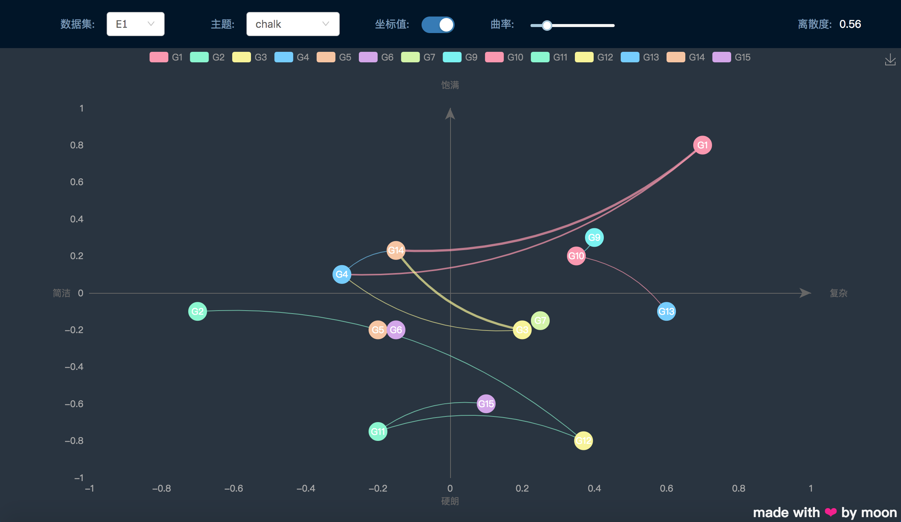

## Htt Graphic
----

### Show the distribution and correlation of nodes

requirements:
- [node](https://nodejs.org/en/) > 8.0.0
- [yarn](https://yarnpkg.com)

how to run:
1. clone(download) the repository 
1. enter code directory `cd {your directory}/htt-graphic`
1. install dependents `yarn`
1. development `yarn start`
1. build `yarn build`

_____

### preview

